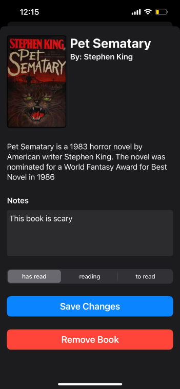
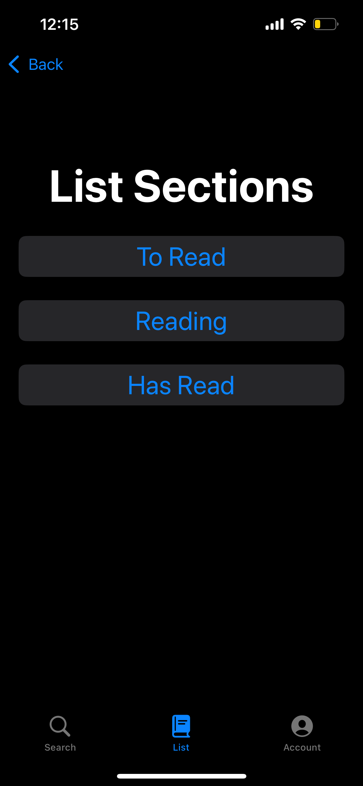

# Reading List

This is an iOS reading list app made with SwiftUI.

Features include:

- User signup + login
- User data stored in MongoDB databse
- Search for books using OpenLibrary API that can be added to personal list
- Sort books into categories and add personal notes

[Link to backend repo](https://github.com/tcbarzyk/reading-list-backend)

## Images

